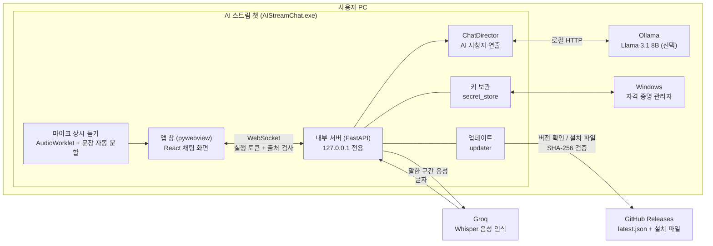

# AI 스트림 챗

> 혼자 방송해도 채팅창이 비어 있지 않게.
> 방송인의 목소리를 듣고 **AI 시청자들이 실시간으로 채팅을 올려주는** Windows 프로그램이에요.

말을 하면 그 내용을 글자로 바꾸고, 성격이 다른 AI 시청자 3명이 인방 채팅처럼 반응해요. 방송 연습을 하거나, 시청자가 아직 적은 초보 방송인이 리액션을 받으며 말하는 감각을 익히는 데 쓸 수 있어요.

> ⚠️ **채팅창의 시청자는 모두 AI예요.** 모든 메시지에 `AI` 배지가 붙고 채팅창 위에도 안내가 표시돼요. 이 프로그램은 실제 방송 플랫폼(유튜브, 치지직, SOOP 등)의 시청자 수나 채팅에 아무것도 넣지 않아요. AI 채팅 화면을 방송에 송출할 때는 AI라는 표시가 보이도록 해주세요.

---

## 목차

1. [주요 기능](#주요-기능)
2. [필요한 것 (설치 전 준비)](#필요한-것-설치-전-준비)
3. [설치 방법](#설치-방법)
4. [Groq API 키 발급 방법](#groq-api-키-발급-방법)
5. [처음 실행하기](#처음-실행하기)
6. [설정 화면 안내](#설정-화면-안내)
7. [사용 팁](#사용-팁)
8. [업데이트](#업데이트)
9. [개인정보와 보안](#개인정보와-보안)
10. [문제 해결 (FAQ)](#문제-해결-faq)
11. [삭제하기](#삭제하기)
12. [아키텍처](#아키텍처)
13. [개발자용: 빌드와 릴리즈](#개발자용-빌드와-릴리즈)
14. [라이선스와 고지](#라이선스와-고지)

---

## 주요 기능

### 🎙️ 마이크 상시 듣기 + 자동 문장 나누기
- 마이크 버튼을 한 번 켜두면, 말을 멈출 때마다(약 0.8초) 자동으로 한 문장씩 잘라서 글자로 바꿔요.
- 0.5초보다 짧은 소리(기침, 키보드 소리)는 버리고, 15초 넘게 쉬지 않고 말하면 15초에서 한 번 끊어요.
- 주변 소음 크기를 따라가서, 시끄러운 방에서는 말로 인식하는 기준이 자동으로 올라가요.
- 탑바의 파형이 실제 마이크 소리에 맞춰 움직여요.
- 마이크가 켜져 있으면 **작업 표시줄 아이콘에 빨간 점**이 붙어요 (OBS처럼).

### 💬 AI 시청자 3명

| 시청자 | 성격 |
|---|---|
| **꾹이** | 말 많은 수다쟁이. 리액션이 크고, 방송인이 조용하면 혼자 떠들어요 |
| **질문봇아님** | 궁금한 건 못 참아요. 방금 한 말에 짧게 질문해요 |
| **조용한관전러** | 말수가 적고 장난을 좋아해요. 가끔 한마디씩 툭 던져요 |

- 방송인이 말하면 약 3초 뒤 각자 성격대로 반응해요.
- 방송인이 60초 동안 조용하면 꾹이가 혼자 잡담을 해요.
- 한국어 한글로만 채팅해요. 영어·한자·이모지·이상한 기호는 걸러내요.
- 욕설, 혐오 표현, 링크, 운영자 사칭, 후원 유도, 개인정보 질문은 걸러내요.
- AI 시청자의 두뇌는 **둘 중에 골라요.** 설정에서 바꿀 수 있어요.
  - **Groq gpt-oss-120b (클라우드)**: 설치할 게 없고, 훨씬 똑똑하고 빨라요. 방송인이 한 말(글자)이 Groq로 전송돼요. 음성 인식에 쓰는 같은 Groq 키를 써요.
  - **Llama 3.1 8B (내 PC)**: 내 PC의 Ollama에서 돌아가서 말한 내용이 PC 밖으로 나가지 않아요. 대신 Ollama 설치와 모델 받기가 필요하고, PC 사양에 따라 느릴 수 있어요.

### 🧑 방송인 정보
- 설정에서 방송인 이름과 방송 소개를 적으면 시청자들이 그 이름으로 부르고 방송 분위기에 맞게 반응해요.
- 탑바 스위치를 켜면 내가 한 말이 채팅 사이에 보라색으로 함께 보여요.

### 🔄 업데이트
- 설정 맨 아래에서 새 버전을 확인하고, 버튼 하나로 업데이트할 수 있어요.

---

## 필요한 것 (설치 전 준비)

### 컴퓨터 사양

| 항목 | 최소 | 권장 |
|---|---|---|
| 운영체제 | Windows 10 (64비트) | Windows 11 (64비트) |
| 메모리 | 8GB | 16GB 이상 (방송 프로그램과 같이 쓸 경우) |
| 저장공간 | 약 5GB 여유 (모델 포함) | 10GB 이상 (큰 모델까지 쓸 경우) |
| 마이크 | 아무 마이크 | **헤드셋 권장** ([사용 팁](#사용-팁) 참고) |
| 인터넷 | 음성 인식에 필요 | |

> Mac은 아직 지원하지 않아요.

### 다운로드할 것 (기본 2개 + 선택 1개)

| 순서 | 무엇 | 어디서 | 왜 필요한가 |
|---|---|---|---|
| ① | **AI 스트림 챗 설치 파일** | [Releases 페이지](https://github.com/nana255255/ai-stream-chat_rel/releases/latest)의 `AIStreamChat-Setup-x.x.x.exe` | 이 프로그램 |
| ② | **Groq API 키** (무료) | https://console.groq.com/keys | 방송인 목소리를 글자로 바꾸고, 클라우드 AI 시청자를 쓰는 데 필요 ([발급 방법](#groq-api-키-발급-방법)) |
| ③ | **Ollama** (선택) | https://ollama.com/download | **내 PC 안에서만** AI 시청자를 돌리고 싶을 때만 필요해요. Groq 모델을 쓸 거면 설치하지 않아도 돼요 |

---

## 설치 방법

### 1단계. Ollama 설치 (내 PC 모델을 쓸 때만, 아니면 건너뛰세요)

1. https://ollama.com/download 에 들어가서 **Download for Windows**를 눌러요.
2. 받은 `OllamaSetup.exe`를 실행해서 설치해요.
3. 설치가 끝나면 Ollama 창이 열리는데, **닫아도 괜찮아요.** 화면 오른쪽 아래 알림 영역(시계 옆 `^` 버튼)에 라마 아이콘이 있으면 Ollama가 켜져 있는 거예요. PC를 켤 때 자동으로 실행돼요.

### 2단계. AI 모델 받기

1. 시작 버튼을 누르고 **PowerShell**(또는 명령 프롬프트)을 검색해서 열어요.
2. 아래 명령을 입력하고 엔터를 눌러요. 약 5GB를 받아요.

   ```
   ollama pull llama3.1:8b
   ```

3. 마지막에 `success`가 나오면 끝이에요.

> **명령어를 어느 폴더에서 실행해도 상관없어요.** 모델은 Ollama가 정해둔 폴더(`C:\Users\사용자\.ollama\models`)에 저장돼요.
>
> `ollama`를 찾을 수 없다는 오류가 나오면 PowerShell 창을 닫고 새로 열어보세요.

### 3단계. AI 스트림 챗 설치

1. [Releases 페이지](https://github.com/nana255255/ai-stream-chat_rel/releases/latest)에서 `AIStreamChat-Setup-x.x.x.exe`를 받아요.
2. 실행하면 **"Windows의 PC 보호"** 창이 뜰 수 있어요. 아직 코드 서명(유료 인증서)을 하지 않은 프로그램이라 그래요.
   - **추가 정보** → **실행**을 누르면 설치가 계속돼요.
3. **바탕화면에 아이콘 만들기**를 체크하고 설치해요.
4. 관리자 권한 없이 설치돼요. 설치 위치: `C:\Users\사용자\AppData\Local\Programs\AIStreamChat`

### 4단계. Groq API 키 준비

아래 [Groq API 키 발급 방법](#groq-api-키-발급-방법)을 따라 키를 만들어 두세요.

---

## Groq API 키 발급 방법

방송인의 목소리를 글자로 바꾸는 음성 인식에 **Groq**라는 서비스를 써요. 무료로 가입하고 키를 받을 수 있어요.

### 키 만들기

1. **https://console.groq.com** 에 접속해요.
2. 오른쪽 위 **Sign In** (또는 **Sign Up**)을 눌러요.
   - Google 계정, GitHub 계정, 이메일 중 편한 걸로 가입하면 돼요.
3. 로그인하면 왼쪽 메뉴에서 **API Keys**를 눌러요. (바로 가기: https://console.groq.com/keys )
4. **Create API Key** 버튼을 눌러요.
5. 키 이름을 적어요. 아무 이름이나 괜찮아요. (예: `ai-stream-chat`)
6. **Submit**을 누르면 `gsk_`로 시작하는 긴 키가 나타나요.
7. **바로 복사(Copy)하세요.** 이 화면을 닫으면 키를 다시 볼 수 없어요. 잃어버리면 새로 만들면 돼요.

### 키 다룰 때 주의할 점

- 🔒 **키는 비밀번호와 같아요.** 다른 사람에게 보여주거나, 카톡·디스코드에 올리거나, 스크린샷에 찍히지 않게 주의하세요.
- 키가 노출됐다고 생각되면 https://console.groq.com/keys 에서 그 키를 **삭제(Revoke)**하고 새로 만드세요.
- 무료 플랜에는 하루 사용량 제한이 있어요(음성 인식 요청 수와 음성 길이). 제한은 Groq 정책에 따라 바뀔 수 있으니 Groq 콘솔에서 확인하세요. 혼자 방송 연습하는 정도는 대부분 충분해요.

---

## 처음 실행하기

1. 바탕화면의 **AI 스트림 챗** 아이콘을 더블클릭해요.
2. **"음성 인식 키를 넣어주세요"** 창이 떠요.
   - 복사해 둔 Groq 키를 붙여넣어요.
   - **이 PC에 저장** 체크박스는 기본으로 꺼져 있어요. ([아래 설명](#음성-인식-groq-api-키) 참고)
   - **저장**을 누르면 Groq에 키가 맞는지 확인한 뒤 적용돼요. 틀린 키면 이유가 표시돼요.
3. 탑바의 **마이크 버튼**을 눌러요. 처음이면 마이크 사용 권한을 물어보니 **허용**을 눌러요.
4. 평소처럼 말해 보세요. 말을 멈추면 몇 초 뒤 시청자들이 반응해요.

> 이미 켜져 있을 때 아이콘을 또 누르면, 새로 열리지 않고 기존 창이 앞으로 와요.

### 화면 구성

```
┌──────────────────────────────────────────────┐
│ AI 스트림 챗   ∿∿∿∿∿∿   [🎙️] [토글] [⚙️]     │ ← 탑바: 파형 / 마이크 / 내 말 보이기 / 설정
├──────────────────────────────────────────────┤
│      채팅      │      시청자 3                │ ← 탭
├──────────────────────────────────────────────┤
│ AI 꾹이                                       │
│ 라면 ㅋㅋㅋ 나도 아까 먹었는데                 │
│ 🎙 방송인                                     │ ← 토글을 켜면 내 말도 보여요
│ 오늘 점심에 라면 먹었어요                      │
│ AI 질문봇아님                                 │
│ 무슨 라면 드셨어요?                            │
└──────────────────────────────────────────────┘
```

---

## 설정 화면 안내

탑바 오른쪽 ⚙️ 버튼을 누르면 열려요. 설정은 위쪽 **탭 3개**로 나뉘어 있고, **취소 / 저장 버튼은 어느 탭에서나 아래에 고정**돼 있어요. 탭을 오가며 바꾼 값은 사라지지 않고, 저장을 한 번 누르면 함께 반영돼요.

| 탭 | 들어 있는 것 |
|---|---|
| **방송인 정보** (처음 열면 이 탭) | 방송인 이름·방송 소개, 맨 아래에 버전·업데이트·오픈소스 |
| **AI 모델** | 음성 인식 모델(Groq 키, 음성인식 정확도), AI 시청자 모델, Groq 무료 한도 |
| **AI 시청자** | 참여 인원, 함께할 시청자 |

### 방송인 정보 탭
| 항목 | 설명 |
|---|---|
| 방송인 이름 (20자) | 시청자들이 이 이름으로 불러요. 비워두면 '방송인'으로 불러요. 실명 대신 방송용 닉네임을 추천해요 |
| 방송 소개 (200자) | 방송 주제, 말투, 원하는 분위기를 적어요. 예: "퇴근 후 테트리스 하는 직장인. 시청자랑 반말로 편하게 수다 떠는 걸 좋아함." |

> 주소·연락처 같은 개인정보는 적지 마세요.

### AI 모델 탭 · 음성 인식 모델 (Groq API 키)
| 상태 | 표시 |
|---|---|
| 키 없음 | "등록된 키가 없어요" + **키 입력** 버튼 |
| 키 있음 (PC에 저장) | `gsk_••••••••abcd` + **수정** 버튼 |
| 키 있음 (이번 실행만) | `gsk_••••••••abcd · 이번 실행에만 사용` |

**"이 PC에 저장" 체크박스**

| | 체크 안 함 (기본) | 체크함 |
|---|---|---|
| 저장 위치 | 저장하지 않음 (프로그램이 켜져 있는 동안 메모리에만) | Windows 자격 증명 관리자 |
| 다음 실행 때 | 키를 다시 입력해야 함 | 자동으로 사용 |
| 추천 | **공용 컴퓨터**, PC방 | 내 개인 PC |

> 🔴 **공용 컴퓨터에서는 체크하지 마세요!**

- **수정**을 누르면 "기존 키가 삭제돼요" 확인 후 새 키를 입력할 수 있어요.
- 키는 화면에 앞 4글자와 뒤 4글자만 보이고, 원래 키는 다시 볼 수 없어요.
- 키 없이 마이크를 누르면 "음성 인식 키가 없어요" 안내가 뜨고, **설정 열기**로 바로 이동할 수 있어요.

### 음성인식 정확도
| 선택 | 모델 | 특징 |
|---|---|---|
| **일반** (기본) | `whisper-large-v3-turbo` | 빠르고 사용량 부담이 적어요 |
| **고급** | `whisper-large-v3` | 더 정확하게 알아들어요 · 조금 느릴 수 있어요 |

- 설정의 **음성 인식 모델** 영역에서 위아래로 두 가지 중에 골라요. 둘 다 **같은 Groq API 키**로 쓰고, 고르면 바로 적용되고 다음 실행에도 기억돼요.
- 일반과 고급은 Groq에서 **한도가 따로 계산돼요.** (아래 [Groq 무료 한도](#groq-무료-한도) 참고)

### AI 시청자 모델
| 모델 | 어디서 돌아가요 | 특징 |
|---|---|---|
| **Llama 3.1 8B** | 내 PC (Ollama) | 말한 내용이 PC 밖으로 나가지 않아요 · 메모리 8GB 이상, 대답이 느릴 수 있어요 |
| **Groq gpt-oss-120b** | Groq 클라우드 (API) | 훨씬 똑똑하고 빨라요 · 방송인이 한 말이 Groq로 전송돼요 · Groq 키 필요 |

- 쓸 수 없는 모델은 **회색으로 막히고** 이유가 표시돼요: `설치 안 됨`(설치 명령도 함께 표시), `Ollama 꺼짐`, `Groq 키 필요`.
- Groq 모델은 음성 인식과 **같은 Groq 키**를 써요. 무료 한도는 모델마다 따로 정해져 있으니 [Groq 콘솔](https://console.groq.com)의 Limits에서 확인하세요.
- 고른 모델은 기억돼서 다음 실행에도 그대로 써요.
- 모델을 바꾸면 첫 대답은 모델을 불러오느라 조금 늦을 수 있어요.

### Groq 무료 한도
설정에서 **쓰는 모델 3개의 한도와, 이 PC에서 쓴 양**을 막대로 볼 수 있어요. 막대가 거의 차면 주황색, 다 차면 빨간색으로 바뀌고, 막힌 동안에는 채팅창 위에 "Groq 무료 한도(분당 요청)에 거의 닿아서 잠시 쉬어요 · 약 N초 뒤에 다시 시작돼요"가 떠요.

| 모델 | 분당 요청 | 하루 요청 | 분당 토큰 | 하루 토큰 | 시간당 음성 | 하루 음성 |
|---|---|---|---|---|---|---|
| 음성 인식 · 일반 (`whisper-large-v3-turbo`) | 20 → **18** | 2,000 → **1,800** | - | - | 7,200초 → **6,480** | 28,800초 → **25,920** |
| 음성 인식 · 고급 (`whisper-large-v3`) | 20 → **18** | 2,000 → **1,800** | - | - | 7,200초 → **6,480** | 28,800초 → **25,920** |
| AI 시청자 · `openai/gpt-oss-120b` | 30 → **27** | 1,000 → **900** | 8,000 → **7,200** | 200,000 → **180,000** | - | - |

- 왼쪽 값이 **Groq 무료 플랜 공식 한도**([Groq 문서](https://console.groq.com/docs/rate-limits), 2026-10 확인), 오른쪽 굵은 값이 **앱이 멈추는 값(공식 한도의 90%)**이에요. 한도에 닿아서 Groq가 오류를 내기 전에 미리 쉬어요.
- 음성 인식은 요청 하나를 **최소 10초**로 세요(Groq 방식). 그래서 짧게 자주 끊어 말하면 "하루 음성"보다 "하루 요청"이 먼저 차요.
- 최근 1분·1시간·24시간을 굴러가는 방식으로 세고, 프로그램을 껐다 켜도 이어서 세요. (숫자만 `groq_usage.json`에 저장돼요. 키나 말한 내용은 저장하지 않아요.)
- 한도는 **Groq 계정 전체**에 적용돼요. 같은 키를 다른 곳에서도 쓰면 여기 표시보다 빨리 찰 수 있고, Groq가 정책을 바꾸면 값이 달라질 수 있어요. 정확한 현재 값은 [Groq 콘솔 Limits](https://console.groq.com/settings/limits)에서 확인하세요.
- 안전 비율(90%)은 환경변수 `GROQ_LIMIT_SAFETY`(0.5~1.0)로 바꿀 수 있어요.

### AI 시청자 탭
- **참여 인원**: 1~3명
- **함께할 시청자**: 원하는 시청자를 골라요. 덜 고르면 나머지는 자동으로 채워져요.

### 방송인 정보 탭 맨 아래 · 버전과 오픈소스
- 현재 버전이 표시되고, 누르면 새 버전을 다시 확인해요. ([업데이트](#업데이트) 참고)
- 그 아래 **오픈소스**를 누르면 새 창에서 이 프로그램이 쓰는 오픈소스·AI 모델·서비스의 목록과 라이선스가 나와요. 항목을 누르면 기본 브라우저에서 해당 페이지가 열려요.

---

## 사용 팁

### 🎧 헤드셋을 쓰세요
마이크는 **소리 크기**로 말을 감지해요. 그래서:

| 상황 | 결과 |
|---|---|
| ✅ 헤드셋 사용 | 방송인 목소리만 잡혀서 가장 정확해요 |
| ⚠️ 스피커로 배경음악 | 노래(특히 가사)를 말로 착각해서, 시청자가 가사에 반응하고 음성 인식 사용량도 낭비돼요 |
| ⚠️ 스피커로 디스코드 합방 | 상대방 목소리도 내 말로 인식돼요 |
| ⚠️ 한 마이크에 두 명 | 둘 다 잡히지만 누가 말했는지 구분은 안 되고, 겹치면 인식이 부정확해요 |

### 💡 그 밖에
- 탑바 스위치를 켜두면 내 말이 어떻게 인식됐는지 볼 수 있어요. 시청자가 엉뚱하게 반응하면, 먼저 인식된 문장이 맞는지 확인해 보세요.
- 마이크를 켜두고 말을 안 하는 동안에는 음성이 서버로 가지 않아서 사용량이 들지 않아요.
- 시청자 반응이 너무 엉뚱하거나 느리면 설정에서 **Groq gpt-oss-120b**로 바꿔보세요.

---

## 업데이트

- 설정을 열면 새 버전이 있는지 자동으로 확인해요.
- 새 버전이 있으면 맨 아래에 **새 버전 x.x.x · 업데이트** 버튼이 나와요.
- 누르면: 받는 중(진행률) → 파일 확인 → 설치 시작 → 프로그램이 닫혔다가 **새 버전으로 다시 열려요.**
- **자동으로 설치되지는 않아요.** 방송 중 갑자기 꺼지지 않도록, 사용자가 버튼을 눌러야만 설치해요.

**업데이트해도 유지되는 것**

| 항목 | 유지 여부 |
|---|---|
| "이 PC에 저장"으로 넣은 Groq 키 | ✅ 유지 |
| 방송인 이름·소개, 모델 선택, 마이크 설정 | ✅ 유지 |
| "저장 안 함"으로 넣은 키 | ❌ 재시작되므로 다시 입력 |

> 받은 설치 파일은 GitHub 릴리즈에 함께 올라온 지문(SHA-256)과 정확히 같을 때만 실행돼요. 중간에 파일이 바뀌면 설치하지 않아요.

---

## 개인정보와 보안

### 어떤 데이터가 어디로 가나요?

| 데이터 | 어디로 | 설명 |
|---|---|---|
| 방송인 목소리 | **Groq** (음성 인식) | 말한 구간만 잘라서 보내요. 조용한 동안에는 아무것도 보내지 않아요 |
| 글자로 바뀐 방송인 말·방송 소개 | 모델에 따라 달라요 | **Llama(내 PC)**: 내 PC 안에서만 · **Groq gpt-oss-120b**: Groq로 전송돼요 (음성 인식에 이미 Groq를 쓰고 있어요) |
| AI 시청자 채팅 | 내 PC 안에서만 | 만들어진 채팅은 외부로 보내지 않아요 |
| Groq API 키 | 내 PC 안에서만 | 저장하면 Windows 자격 증명 관리자에, 아니면 메모리에만 |
| 업데이트 확인 | GitHub | 버전 정보 파일만 받아요. 내 정보는 보내지 않아요 |

### 보안 설계
- **이 PC 안에서만 열려요.** 프로그램 내부 서버는 `127.0.0.1`에서만 동작해서, 같은 와이파이의 다른 기기에서 접속할 수 없어요.
- **실행할 때마다 새 비밀 토큰**을 만들어서, 프로그램 창이 아닌 다른 곳(예: 브라우저에서 연 다른 웹사이트)이 몰래 접속하는 걸 막아요.
- **키는 프로그램 파일에 들어가지 않아요.** 다른 사람이 같은 설치 파일을 받아도 내 키는 없어요. 그 사람은 자기 키를 넣어야 해요.
- 채팅은 모두 순수 텍스트로만 표시해서, 이상한 코드가 화면에서 실행되지 않아요.
- AI 시청자는 방송인의 말 속에 "이렇게 채팅해" 같은 지시가 있어도 따르지 않도록 만들었어요.

### 내 PC에 저장되는 파일

| 위치 | 내용 |
|---|---|
| `%LOCALAPPDATA%\Programs\AIStreamChat` | 프로그램 본체 |
| `%LOCALAPPDATA%\AIStreamChat` | 화면 파일 사본, 로그(`logs`), 캐시, 화면 설정, Groq 사용량 숫자(`groq_usage.json`) |
| Windows 자격 증명 관리자 → `ai-stream-chat` | "이 PC에 저장"한 Groq 키 |
| `C:\Users\사용자\.ollama\models` | Ollama가 받은 AI 모델 |

> `%LOCALAPPDATA%`는 보통 `C:\Users\사용자\AppData\Local`이에요. 탐색기 주소창에 그대로 입력하면 열려요.

---

## 문제 해결 (FAQ)

**Q. 시청자가 "ㅋㅋ" 같은 짧은 말만 하거나 반응이 없어요.**
AI 모델을 못 부른 경우예요. 설정 → AI 시청자 모델에서 지금 고른 모델과 상태를 먼저 확인하세요.
- **Groq 모델**: Groq 키가 올바른지, Groq 무료 한도를 다 쓰지 않았는지 확인하세요. 한도에 걸리면 잠시 짧은 대체 반응만 나와요.
- **내 PC 모델(Llama)**: Ollama가 꺼져 있거나 모델이 없는 경우예요.
- 알림 영역에 Ollama(라마) 아이콘이 있는지 확인하세요. 없으면 시작 메뉴에서 Ollama를 실행하세요.
- PowerShell에서 `ollama list`를 실행해 `llama3.1:8b`가 있는지 확인하세요. 없으면 `ollama pull llama3.1:8b`.
- 설정 → AI 시청자 모델에 "Ollama가 켜져 있지 않아요"가 보이면 Ollama를 켠 뒤 설정을 다시 열어보세요.

**Q. 말해도 글자로 안 바뀌고 시청자도 반응이 없어요.**
- 설정 → 음성 인식 모델에 키가 등록돼 있는지 확인하세요.
- "음성 인식 키가 없거나 올바르지 않아요"가 뜨면 키가 틀렸거나 삭제된 키예요. 새 키를 만들어 다시 넣으세요.
- 마이크 버튼이 빨간색인지, 말할 때 파형이 움직이는지 확인하세요.
- Windows 설정 → 개인정보 및 보안 → 마이크에서 앱의 마이크 사용이 허용돼 있는지 확인하세요.

**Q. 아무 말도 안 했는데 시청자가 반응해요.**
주변 소리(음악, 선풍기, 키보드)를 말로 인식한 경우예요. 헤드셋을 쓰거나 주변을 조용히 해주세요.

**Q. 시청자가 문맥에 안 맞는 말을 해요.**
- 탑바 스위치를 켜서 내 말이 제대로 인식됐는지 먼저 확인하세요.
- 설정에서 **Groq gpt-oss-120b**로 바꾸면 문맥을 훨씬 더 잘 따라가요.
- 작은 AI 모델이라 한국어 문맥 이해에 한계가 있어요.

**Q. 대답이 너무 늦어요.**
- **Groq gpt-oss-120b**로 바꾸면 대답이 훨씬 빨리 와요 (인터넷 상태에 따라 달라요). 내 PC 모델(Llama 8B)은 PC 사양에 따라 한 명당 수 초에서 십몇 초까지 걸릴 수 있어요.
- 그래픽카드가 없는 PC는 AI가 CPU로 돌아서 느릴 수 있어요.
- 방송 프로그램(OBS 등)과 같이 쓰면 메모리가 부족할 수 있어요.

**Q. "오늘 음성 인식 사용 횟수를 모두 사용하셨습니다"가 떠요.**
하루 사용량 한도에 도달했어요. 다음 날 다시 쓸 수 있어요.

**Q. 설치할 때 "Windows의 PC 보호" 창이 떠요.**
코드 서명을 아직 하지 않아서 뜨는 안내예요. **추가 정보 → 실행**을 누르면 설치돼요. 반드시 공식 [Releases 페이지](https://github.com/nana255255/ai-stream-chat_rel/releases)에서 받은 파일만 실행하세요.

**Q. 프로그램이 안 열리거나 오류 창이 떠요.**
`%LOCALAPPDATA%\AIStreamChat\logs` 폴더의 오늘 날짜 로그 파일을 [Issues](https://github.com/nana255255/ai-stream-chat_rel/issues)에 첨부해 주세요. (로그에는 키나 내가 한 말이 기록되지 않아요.)

---

## 삭제하기

1. Windows 설정 → 앱 → 설치된 앱 → **AI 스트림 챗** → 제거
2. 아래는 삭제해도 남아 있어요. 완전히 지우려면 직접 지우세요.
   - **저장한 키**: 시작 메뉴에서 "자격 증명 관리자" → **Windows 자격 증명** → `ai-stream-chat` → 제거
   - **로그와 설정**: `%LOCALAPPDATA%\AIStreamChat` 폴더 삭제
   - **AI 모델**: PowerShell에서 `ollama rm llama3.1:8b` (다른 앱에서 Ollama를 안 쓴다면 Ollama도 제거)

---

## 아키텍처

### 전체 구조



### 한 번 말했을 때 일어나는 일

```
① 방송인이 말함
② [화면] 소리 크기로 말 시작/끝을 감지 → 0.8초 조용하면 한 문장으로 잘라서 서버로 전송
③ [서버] 0.4초 미만이면 버림 → 사용량 한도 확인 → Groq Whisper로 글자 변환
④ [서버] Whisper가 조용한 구간에서 지어내는 문장("시청해주셔서 감사합니다" 등)은 버림
⑤ [서버] 글자를 화면에 보냄 (스위치 켜면 채팅에 보라색으로 표시)
⑥ [ChatDirector] 3초 기다림 (연달아 말하면 마지막 말 기준)
⑦ [ChatDirector] 시청자마다 선택된 모델(Ollama 또는 Groq)에 1번씩 요청
     - 시청자 성격 + 공통 성격 + 방송인 정보 + 반응 예시 대화 + 방금 한 말
     - JSON으로 채팅 몇 줄을 받음
⑧ [검증] JSON 형식, 길이(40자), 한국어만, 금칙어, 링크·전화번호, 방송인 말 따라치기 차단
⑨ [송출 큐] 0.5~3초 랜덤 간격으로 화면에 한 줄씩
⑩ [화면] AI 배지와 함께 채팅 표시 (최대 100개 유지, 초당 3개까지)
```

### 구성 요소

| 레이어 | 기술 | 역할 |
|---|---|---|
| 앱 창 | pywebview (Windows Edge WebView2) | 프로그램 창, 작업 표시줄 빨간 점, 한 번만 실행 |
| 화면 | React + TypeScript + Vite | 채팅창, 설정, 마이크 듣기·문장 분할(AudioWorklet), 파형 |
| 내부 서버 | Python, FastAPI, Uvicorn (open-llm-vtuber 기반) | WebSocket, 인증, 음성 인식 연결, 사용량 한도 |
| AI 시청자 | `viewer_chat` 패키지 + Ollama 또는 Groq (설정에서 선택) | 트리거·디바운스, 페르소나별 생성, 검증, 송출 큐, 장애 시 템플릿으로 대체 |
| 음성 인식 | Groq Whisper (`whisper-large-v3-turbo`) | 방송인 음성 → 한국어 텍스트 |
| 키 보관 | `keyring` → Windows 자격 증명 관리자 | Groq 키 저장, 가린 값만 화면에 전달 |
| 업데이트 | GitHub Releases + `latest.json` | 버전 확인, 허용된 주소만, SHA-256 검증 후 설치 |
| 배포 | PyInstaller + Inno Setup | exe 묶기, 설치 프로그램 |

### 보호 장치 요약

| 구분 | 장치 |
|---|---|
| 접속 | 127.0.0.1 전용, 실행마다 새 토큰, Origin 검사, 사용자당 연결 1개 |
| 입력 | 클라이언트 메시지 화이트리스트, 오디오 버퍼 상한(60초), 프로필 길이 제한 |
| AI 프롬프트 | 방송인 말·소개는 구분자로 감싼 데이터로만 삽입, 지시 무시 규칙 |
| AI 출력 | JSON 검증, 한국어만, 금칙어·사칭·후원 유도·링크·연락처 제거, 따라치기 차단 |
| 남용 방지 | 디바운스, 분당 생성 상한, Ollama 동시 실행 1개(Groq는 병렬 가능), 연속 실패 시 템플릿 모드 |
| 비용 | Whisper 일일 총량 가드, 인당 일일 음성 한도, 짧은 소리·환각 문장 차단 |
| 키 | OS 보안 저장소 또는 메모리, 로그·응답에 원문 없음, 빌드 결과물 키 검사 |
| 업데이트 | 고정된 확인 주소, HTTPS + 허용 호스트, 크기 상한, SHA-256 일치 시에만 실행 |

---

## 개발자용: 빌드와 릴리즈

### 저장소 구조

```
ai-stream-chat/                    # 서버 + 배포
├─ desktop_main.py                 # 배포판 시작 파일
├─ run_server.py                   # 개발 서버 시작 파일
├─ build-release.ps1               # 한 번에 빌드
├─ AIStreamChat.spec               # PyInstaller 설정
├─ conf.yaml                       # open-llm-vtuber 설정 (키는 ${GROQ_API_KEY})
├─ installer/ai-stream-chat.iss    # Inno Setup 설정
├─ tools/make_update_manifest.py   # latest.json 생성
├─ resources/                      # 아이콘 (icon.ico, mic_on.ico)
├─ frontend/dist/                  # 프론트 빌드 결과를 여기에 복사
└─ src/open_llm_vtuber/
   ├─ app_info.py                  # 버전, 업데이트 주소
   ├─ app_paths.py                 # 배포판 경로 (사용자 데이터 폴더)
   ├─ desktop_shell.py             # 한 번만 실행, 작업 표시줄 빨간 점
   ├─ secret_store.py              # Groq 키 보관
   ├─ updater.py                   # 업데이트
   ├─ routes.py                    # WebSocket 인증
   ├─ websocket_handler.py         # 메시지 라우팅
   ├─ conversations/conversation_handler.py   # 음성 → 글자 → AI 시청자
   └─ viewer_chat/                 # AI 시청자
      ├─ director.py  generator.py  validator.py
      ├─ personas.py  models.py     config.py

ai-stream-chat-web/                # 화면
└─ src/
   ├─ App.tsx
   ├─ hooks/useChat.ts, useChatSocket.ts
   ├─ lib/ws.ts
   └─ ai-stream-chat/              # 채팅창, 설정, 마이크, 저장소
```

### 개발 실행

```powershell
# 서버 프로젝트 루트
uv sync --extra desktop --group build
uv run --env-file .env --env-file .env.dev run_server.py   # 브라우저: http://localhost:12393
uv run python desktop_main.py                              # 앱 창으로 실행
```

`.env.dev` (내 PC 전용, git에 올리지 않음):
```
DEV_ALLOW_LOCAL_NO_AUTH=1
ALLOW_LOCAL_KEY_SETTINGS=1
```

설정 가능한 값 전체는 [`.env.example`](.env.example)을 참고하세요. AI 시청자 성격은 `src/open_llm_vtuber/viewer_chat/personas.py`에서 바꿔요.

### 릴리즈 순서

1. `src/open_llm_vtuber/app_info.py`의 `APP_VERSION`과 `installer/ai-stream-chat.iss`의 `AppVersion`을 같은 값으로 올려요.
2. 프론트를 빌드해서 `frontend/dist`에 넣어요.
3. 빌드:
   ```powershell
   .\build-release.ps1 -Release -Notes "변경 내용"
   ```
   빌드 결과물에 Groq 키가 들어가면 자동으로 멈춰요.
4. GitHub → **Releases** → **Draft a new release** → 태그 `v버전` → 아래 두 파일 첨부 → **Publish** (pre-release 체크 X)
   - `installer/Output/AIStreamChat-Setup-버전.exe`
   - `installer/Output/latest.json`
5. 확인: https://github.com/nana255255/ai-stream-chat_rel/releases/latest/download/latest.json 이 열리면 성공

---

## 라이선스와 고지

- **Built with Llama** — 내 PC 모델을 고르면 Meta의 Llama 3.1을 사용하며, 이 모델은 [Llama Community License](https://www.llama.com/llama-downloads/)와 [이용 정책](https://www.llama.com/use-policy/)을 따라요. 모델은 이 프로그램에 포함되지 않고, 사용자가 Ollama로 직접 받아요.
- **gpt-oss-120b** — OpenAI가 Apache 2.0 라이선스로 공개한 모델이며, 이 프로그램은 Groq의 API로 호출해요. Groq 이용은 Groq 약관을 따라요.
- 이 프로젝트는 [Open-LLM-VTuber](https://github.com/Open-LLM-VTuber/Open-LLM-VTuber)를 기반으로 만들었어요. 해당 프로젝트의 라이선스를 따라요.
- 음성 인식은 [Groq](https://groq.com)의 서비스를 사용하며, 사용자는 Groq의 이용약관을 따라야 해요.
- [Ollama](https://ollama.com)는 별도로 설치하는 프로그램이에요.
- 채팅창의 시청자는 모두 AI가 생성한 것이며 실제 사람이 아니에요.
